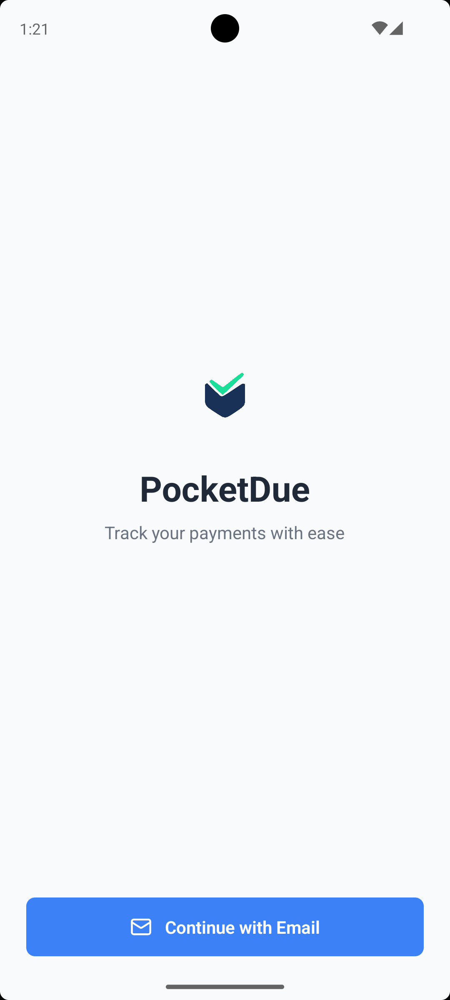
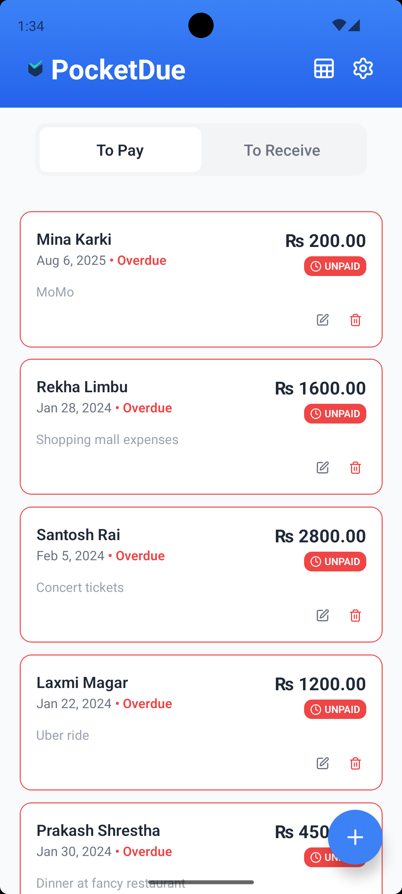
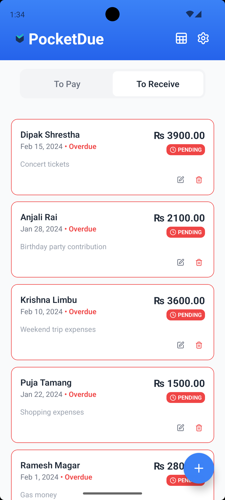
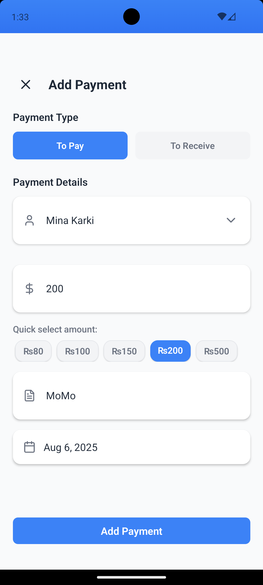
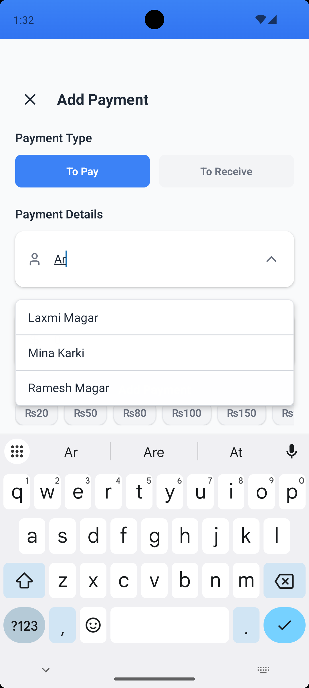
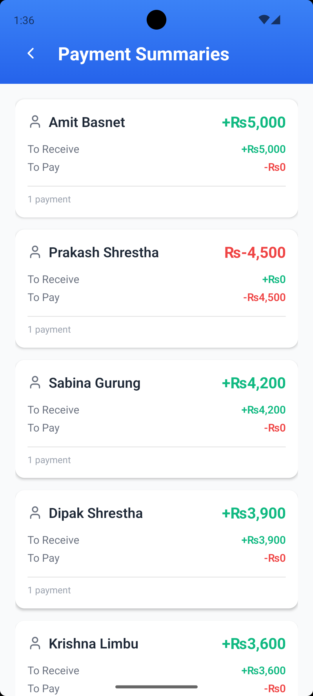
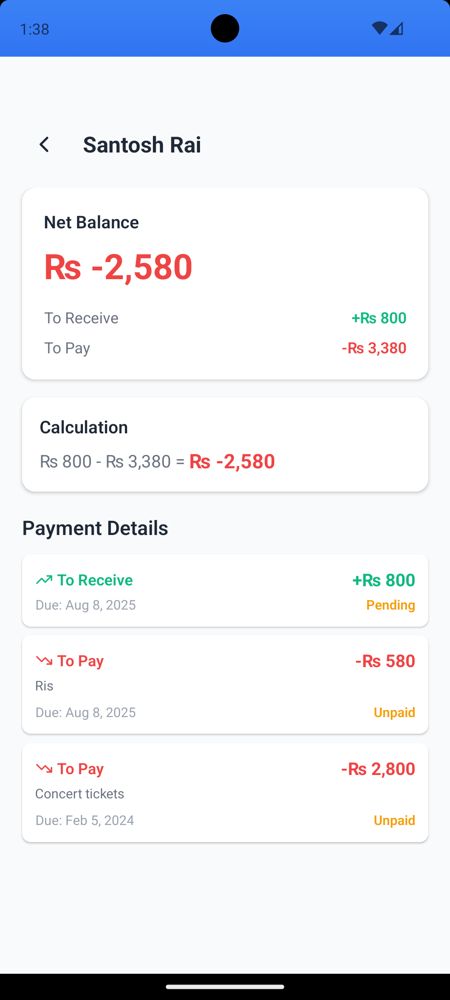
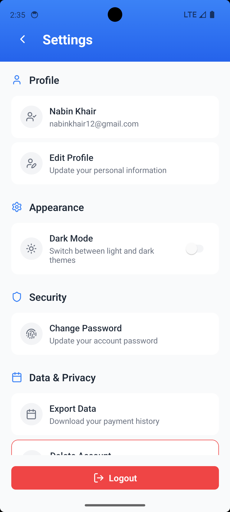

  
  <h1>PocketDue - Personal Finance Management App</h1>

**PocketDue** is a comprehensive personal finance management application designed to help you track your income, expenses, and financial goals with ease. Take control of your financial future with our intuitive and powerful finance tracking solution.

## Features

- **Income & Expense Tracking** - Monitor your cash flow with detailed categorization
- **Visual Analytics** - Interactive charts and graphs for better financial insights
- **Payment Management** - Track payments you need to make and receive
- **Financial Summaries** - Get comprehensive overviews of your financial status
- **Secure Data Storage** - Your financial data is protected with enterprise-grade security
- **Cross-Platform Access** - Available on iOS, Android, and Web platforms
- **Real-time Synchronization** - Access your data anywhere, anytime
- **Financial Goals** - Set and achieve your financial objectives
- **Report Generation** - Generate detailed financial reports for analysis

## Screenshots

### App Interface

  
  
  
  
  
  
  
  

### Key Features Showcase

- **Clean and Intuitive Interface** - Modern design with easy navigation
- **Payment Tracking** - Comprehensive payment management system
- **Financial Summaries** - Detailed overview of your financial status
- **Real-time Updates** - Instant synchronization across devices
- **Visual Analytics** - Charts and graphs for better insights

## Author

**nabinkhair42**
- GitHub: [@nabinkhair42](https://github.com/nabinkhair42)

## Acknowledgments

- Thanks to all contributors who helped make this project better
- Inspired by the need for simple yet powerful personal finance management
- Built with love for the open-source community

**Happy Financial Tracking!**
