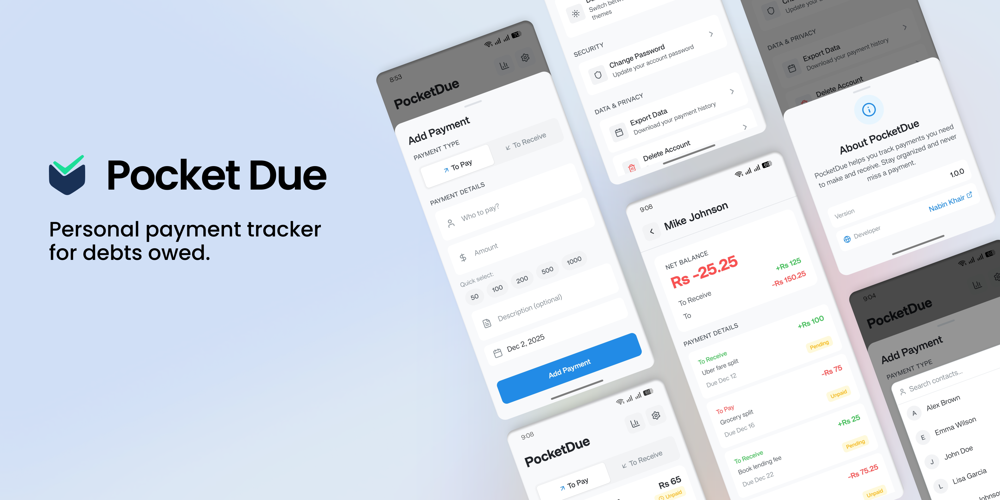

  
  <h1>PocketDue - Personal Finance Management App</h1>

**PocketDue** is a cross-platform payment tracker for keeping track of money you need to pay and receive. It keeps payment details available offline and synchronizes pending changes when the device reconnects.

## Features

- **Pay and Receive Tracking** - Record amounts, people, due dates, descriptions, and payment status
- **Offline-First Payments** - Create and manage payments without a connection while changes remain visible on the device
- **Automatic Reconciliation** - Synchronize queued changes after reconnecting without temporarily replacing local data
- **Financial Summaries** - Review per-person totals, net balances, and individual payment details
- **Cached Experiences** - Open payment lists and summaries immediately from local data while fresh data loads in the background
- **Google and GitHub Sign-In** - Authenticate through OAuth without managing a separate password
- **Live Connectivity Feedback** - See the app's offline state update immediately as network availability changes
- **Cross-Platform Access** - Use PocketDue on Android, iOS, and the web

## Screenshots

### App Interface

### Key Features Showcase

- **Focused Payment Lists** - Switch between payments to make and payments to receive
- **Payment Status Actions** - Mark outgoing payments as paid and incoming payments as received
- **Per-Person Summaries** - Understand total amounts and net balances at a glance
- **Resilient Offline Use** - Continue working during connection changes without losing pending entries
- **Light and Dark Themes** - Use the interface comfortably with the preferred appearance

## Author

**nabinkhair42**
- GitHub: [@nabinkhair42](https://github.com/nabinkhair42)

## Acknowledgments

- Thanks to all contributors who helped make this project better
- Inspired by the need for simple yet powerful personal finance management
- Built with love for the open-source community

**Happy Financial Tracking!**
